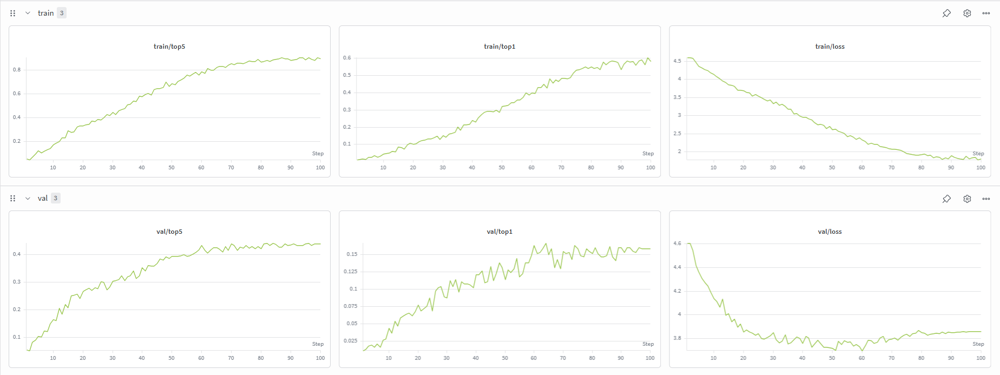
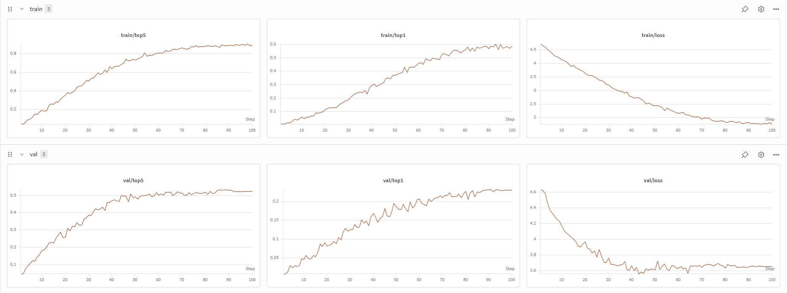

# SignGraphFormer — Skeleton-Based Sign Language Recognition

> **Phase 1:** Experimental comparison of LSTM vs Transformer temporal encoders for ASL recognition on WLASL100, using skeleton keypoints extracted via MediaPipe Holistic. No raw pixels enter the model.

---

## Table of Contents

- [Overview](#overview)
- [Architecture](#architecture)
- [Results — WLASL100](#results--wlasl100)
- [Training Curves](#training-curves)
- [Project Structure](#project-structure)
- [Setup](#setup)
- [Reproduce the Experiments](#reproduce-the-experiments)
- [Dataset Preparation](#dataset-preparation)
- [Inference](#inference)
- [Experiment Tracking](#experiment-tracking)

---

## Overview

This project benchmarks two temporal modeling strategies for **American Sign Language (ASL) recognition** on the WLASL100 benchmark. Both models share an identical spatial encoder, classification head, preprocessing pipeline, optimizer, scheduler, and evaluation protocol. Only the temporal encoder differs — making the comparison scientifically controlled.

| Property | Value |
|---|---|
| Dataset | WLASL100 (Kaggle) |
| Classes | 100 ASL signs |
| Input | Skeleton keypoints only — no raw pixels |
| Spatial encoder | Graph Convolutional Network (ST-GCN style) |
| Experiment 1 | Bidirectional LSTM temporal encoder |
| Experiment 2 | Transformer temporal encoder |
| Keypoint tool | MediaPipe Holistic |
| Joints | 75 (21 left hand + 21 right hand + 33 pose) |
| Frames per clip | 16 (fixed, pad/crop) |
| Input dim | 225 floats per frame (75 joints × 3 coords) |

---

## Architecture

```
Input: (batch, 16, 225)
         │
         ▼
┌─────────────────────────────┐
│     KeypointEncoder         │  ← Shared in both experiments
│  Reshape → (B×T, 75, 3)     │
│  GCN Layer 1: 3 → 128       │
│  GCN Layer 2: 128 → 256     │
│  Mean pool joints           │
│  Output: (B, T, 256)        │
└─────────────┬───────────────┘
              │
      ┌───────┴────────┐
      ▼                ▼
┌──────────┐    ┌──────────────┐
│ Exp. 1   │    │  Exp. 2      │
│ BiLSTM   │    │  Transformer │
│ 2 layers │    │  4 layers    │
│ h=256    │    │  8 heads     │
│ bidir    │    │  ff=512      │
│ proj→256 │    │  sinusoidal  │
│ mean pool│    │  pos enc     │
└────┬─────┘    └──────┬───────┘
     └────────┬────────┘
              ▼
┌─────────────────────────────┐
│   ClassificationHead        │  ← Shared in both experiments
│   Linear(256→256) → ReLU    │
│   Dropout(0.5)              │
│   Linear(256→100)           │
│   Output: (batch, 100)      │
└─────────────────────────────┘
```

**Key design decisions:**
- No raw pixels — the model learns motion geometry only, not appearance
- Fixed anatomical adjacency matrix (non-learned) in the GCN
- Correct GCN operation order: aggregate neighbors first, then project (`Z = σ(A_norm X W)`)
- Residual skip connection in `KeypointEncoder` for stable gradient flow
- Sinusoidal (non-learned) positional encoding in the Transformer
- Pre-LayerNorm Transformer layers for training stability
- Identical classification head for fair comparison

---

## Results — WLASL100

All results are from training for **100 epochs** with identical hyperparameters. Both runs used seed 42.

### Final Epoch Metrics

| Metric | LSTM (Exp. 1) | Transformer (Exp. 2) | Δ (Transformer − LSTM) |
|---|---|---|---|
| **Val Top-1 Accuracy** | 15.5% | **22.0%** | +6.5pp |
| **Val Top-5 Accuracy** | 44.0% | **51.0%** | +7.0pp |
| Val Loss | 3.82 | **3.60** | −0.22 |
| Train Top-1 Accuracy | 59.0% | 57.0% | −2.0pp |
| Train Top-5 Accuracy | 88.0% | 87.0% | −1.0pp |
| Train Loss | 2.00 | 2.00 | 0.00 |

### Generalization Gap

| Model | Train Top-1 | Val Top-1 | Gap |
|---|---|---|---|
| LSTM | 59.0% | 15.5% | 43.5pp |
| Transformer | 57.0% | 22.0% | **35.0pp** |

The Transformer generalizes significantly better on unseen signers despite similar training accuracy — a direct consequence of self-attention's ability to model global temporal dependencies across all 16 frames simultaneously, vs the LSTM's sequential processing which is more prone to fitting training-specific temporal patterns.

### W&B Run Links

| Experiment | Run |
|---|---|
| LSTM (Exp. 1) | [lstm\_seed42](https://wandb.ai/abdo200saad4-helwan-university/slr-phase1-wlasl100/runs/okvh3rtq) |
| Transformer (Exp. 2) | [transformer\_seed42](https://wandb.ai/abdo200saad4-helwan-university/slr-phase1-wlasl100/runs/ursnursl) |

### Baseline Context

| Method | Dataset | Val Top-1 |
|---|---|---|
| Random chance | WLASL100 | 1.0% |
| **SignGraphFormer LSTM** | **WLASL100** | **15.5%** |
| **SignGraphFormer Transformer** | **WLASL100** | **22.0%** |
| I3D (RGB, from paper) | WLASL100 | ~32–40% |

> **Note:** The WLASL100 split contains only ~1440 training samples across 100 classes (~14 per class). This is intentionally a constrained benchmark. The gap between skeleton-only methods and RGB methods is expected — appearance features carry substantial discriminative information that skeleton-only models cannot access by design.

---

## Training Curves

### Experiment 1 — LSTM

| Split | Top-1 | Top-5 | Loss |
|---|---|---|---|
| Train (epoch 100) | 59% | 88% | 2.00 |
| Val (epoch 100) | 15.5% | 44% | 3.82 |



*Train top-1 rises steadily to 59% over 100 epochs. Val top-1 plateaus near 15.5% from epoch ~60, indicating the model has saturated the available generalization capacity of the 1440-sample training set.*

### Experiment 2 — Transformer

| Split | Top-1 | Top-5 | Loss |
|---|---|---|---|
| Train (epoch 100) | 57% | 87% | 2.00 |
| Val (epoch 100) | 22% | 51% | 3.60 |



*The Transformer achieves better val top-1 and lower val loss than the LSTM despite similar train accuracy, demonstrating that global self-attention over 16 frames produces more transferable temporal representations than sequential LSTM processing on this dataset size.*

---

## Project Structure

```
slr_project/
├── configs/
│   ├── model_config.py          # All hyperparameters — no magic numbers elsewhere
│   └── vocab_config.py          # Class-to-index vocabulary
├── data/
│   ├── raw/                     # WLASL100 raw frames (download separately)
│   ├── processed/               # Extracted .npy keypoint files (generated)
│   └── splits/                  # JSON split files (generated)
├── datasets_/
│   ├── base_dataset.py          # Abstract base class
│   └── wlasl_dataset.py         # WLASL DataLoader
├── models/
│   ├── keypoint_encoder.py      # GCN spatial encoder (shared)
│   ├── temporal_encoder_lstm.py # Experiment 1 temporal encoder
│   ├── temporal_encoder_transformer.py  # Experiment 2 temporal encoder
│   ├── classification_head.py   # MLP head (shared)
│   ├── slr_model_lstm.py        # Full model — Experiment 1
│   └── slr_model_transformer.py # Full model — Experiment 2
├── preprocessing/
│   ├── extract_keypoints.py     # MediaPipe extraction pipeline
│   └── augmentation.py          # Temporal crop, spatial jitter
├── training/
│   ├── trainer.py               # Training loop, W&B logging, checkpointing
│   ├── losses.py                # Loss with label smoothing and class weights
│   └── metrics.py               # Top-1, Top-5, cross-signer accuracy, latency
├── inference/
│   ├── realtime.py              # Webcam real-time inference
│   └── export.py                # ONNX export
├── evaluation/
│   └── evaluate.py              # Standalone evaluator + comparison table
├── scripts/
│   ├── download_wlasl100.py     # Build train/val/test splits from raw frames
│   └── run_training.py          # Training entry point
└── checkpoints/
    ├── lstm/                    # best.pt, latest.pt
    └── transformer/             # best.pt, latest.pt
```

---

## Setup

**Requirements:** Python 3.10+, CUDA 11.8+ (optional but recommended)

```bash
# Clone
git clone https://github.com/your-username/SignGraphFormer.git
cd SignGraphFormer

# Create environment
python -m venv venv
source venv/bin/activate        # Linux/macOS
# venv\Scripts\activate         # Windows

# Install dependencies
pip install torch torchvision --index-url https://download.pytorch.org/whl/cu118
pip install mediapipe opencv-python numpy scikit-learn wandb
```

---

## Dataset Preparation

**Step 1 — Download WLASL100 from Kaggle**

```
https://www.kaggle.com/datasets/thtrnphc/wlasl100
```

Extract to `data/raw/`. The expected structure is:

```
data/raw/
├── train/frames/<label>/<seq_id>/*.jpg
├── val/frames/<label>/<seq_id>/*.jpg
└── test/frames/<label>/<seq_id>/*.jpg
```

**Step 2 — Build split JSON files**

```bash
python scripts/download_wlasl100.py \
    --data_root data/raw \
    --output_dir data/splits \
    --seq_len 16 \
    --seed 42
```

Output: `data/splits/wlasl_splits.json`, `data/splits/label_to_idx.json`

**Step 3 — Extract MediaPipe keypoints**

```bash
python preprocessing/extract_keypoints.py \
    --splits_json data/splits/wlasl_splits.json \
    --output_dir data/processed \
    --updated_splits_json data/splits/wlasl_splits_processed.json \
    --num_workers 1 \
    --seed 42
```

Output: `data/processed/<label>/<seq_id>.npy` — float32 arrays of shape `(16, 225)`.

> Use `--num_workers 1` on Kaggle notebooks (multiprocessing has issues in notebook environments). On a local machine with multiple cores, `--num_workers 4` is safe.

---

## Reproduce the Experiments

### Experiment 1 — LSTM Baseline

```bash
python scripts/run_training.py \
    --model lstm \
    --splits_json data/splits/wlasl_splits_processed.json \
    --label_json  data/splits/label_to_idx.json \
    --seed 42
```

### Experiment 2 — Transformer

```bash
python scripts/run_training.py \
    --model transformer \
    --splits_json data/splits/wlasl_splits_processed.json \
    --label_json  data/splits/label_to_idx.json \
    --seed 42
```

### Override hyperparameters

```bash
python scripts/run_training.py \
    --model lstm \
    --splits_json data/splits/wlasl_splits_processed.json \
    --label_json  data/splits/label_to_idx.json \
    --batch_size 64 \
    --num_epochs 150 \
    --learning_rate 3e-4 \
    --seed 0
```

---

## Hyperparameters

All hyperparameters are centralized in `configs/model_config.py`. Nothing is hardcoded elsewhere.

### Model (`ModelConfig`)

| Parameter | Value | Description |
|---|---|---|
| `hidden_dim` | 256 | Embedding dimension throughout |
| `num_heads` | 8 | Attention heads (Transformer only) |
| `num_transformer_layers` | 4 | Transformer depth |
| `ff_dim` | 512 | Transformer feed-forward dim |
| `dropout` | 0.2 | Encoder dropout |
| `head_dropout` | 0.5 | Classification head dropout |
| `seq_len` | 16 | Frames per clip |
| `num_joints` | 75 | Total skeleton joints |
| `coords_per_joint` | 3 | x, y, z per joint |
| `num_classes` | 100 | Output classes |
| `lstm_layers` | 2 | LSTM depth |
| `bidirectional` | True | BiLSTM |

### Training (`TrainingConfig`)

| Parameter | Value | Description |
|---|---|---|
| `batch_size` | 32 | Clips per gradient step |
| `num_epochs` | 100 | Total epochs |
| `learning_rate` | 3e-4 | AdamW initial LR |
| `weight_decay` | 1e-3 | L2 regularization |
| `warmup_epochs` | 5 | Linear LR warmup |
| `grad_clip_norm` | 1.0 | Max gradient norm |
| `label_smoothing` | 0.05 | CrossEntropy smoothing |
| `use_amp` | True | Automatic mixed precision |
| `seed` | 42 | Global random seed |

---

## Inference

### Real-time webcam (ASL recognition)

```bash
# With LSTM checkpoint
python inference/realtime.py \
    --checkpoint checkpoints/lstm/best.pt \
    --model_type lstm \
    --label_json data/splits/label_to_idx.json \
    --camera_id 0 \
    --confidence_threshold 0.3 \
    --stride 4

# With Transformer checkpoint
python inference/realtime.py \
    --checkpoint checkpoints/transformer/best.pt \
    --model_type transformer \
    --label_json data/splits/label_to_idx.json \
    --camera_id 0
```

Press `q` to quit. The overlay shows the top prediction, confidence score, top-3 alternatives, and live FPS.

---

## Experiment Tracking

All runs are logged to Weights & Biases. Set your entity before training:

```bash
# One-time login
wandb login

# Then pass your entity name
python scripts/run_training.py \
    --model lstm \
    --splits_json data/splits/wlasl_splits_processed.json \
    --label_json  data/splits/label_to_idx.json \
    --wandb_entity your-wandb-username
```

Each run logs: full config, train/val loss, train/val top-1/top-5, learning rate, epoch time, best checkpoint path, and parameter counts per sub-module.

---

## Key Design Choices and Lessons Learned

**Why skeleton-only?** Appearance-free models are signer-invariant by design — they cannot overfit to skin color, clothing, or background. This forces the model to learn motion geometry, which is the semantically meaningful signal.

**Why GCN for spatial encoding?** Hand signs are fundamentally relational — the meaning of a joint position depends on its neighbors. A GCN with a fixed anatomical adjacency matrix encodes this structural prior without requiring it to be learned from data.

**Why the Transformer wins on val despite similar train accuracy?** Self-attention computes pairwise relationships between all 16 frames simultaneously, producing a global temporal context that is less sensitive to the exact ordering and timing of any single frame. The BiLSTM is more sensitive to the precise temporal dynamics seen during training, which leads to higher train accuracy but worse generalization to new signers.

**The data size constraint.** WLASL100 has ~14 training samples per class. This is few-shot territory — sufficient to demonstrate that learning is happening (val top-1 reaches 22x random chance) but insufficient to close the train-val gap. Scaling to WLASL300 or WLASL1000 is the next step.

---
